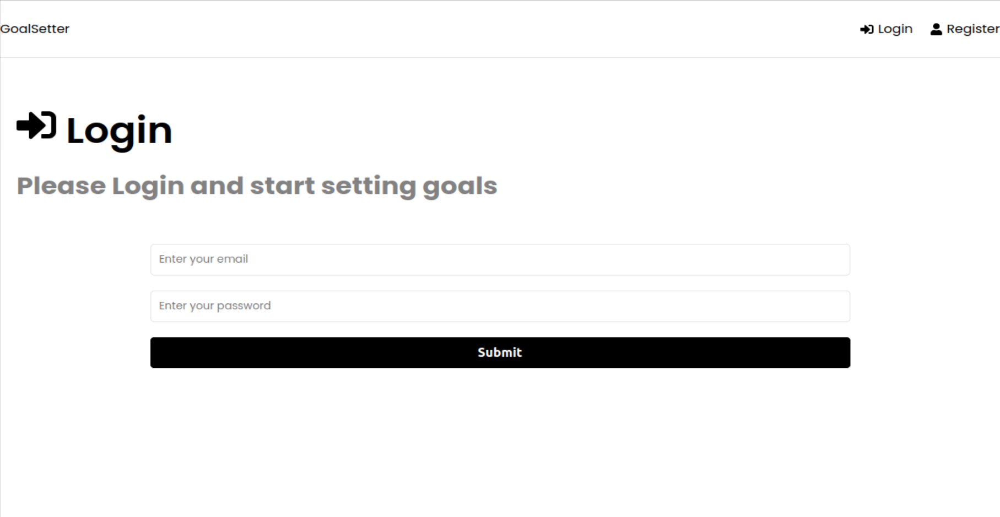

## Jackal: A Goal-Setter upon MERN
by [Guoqian Zeng](https://github.com/JamesZengGit)
> "MERN" is a stack that integrates MongooDB, Express.js, React.js, Node.js under JavaScript and cloud databases for web applications.
### Application
Customer privacy: login the account with the unique credential to edit private goals, on-time logout for securing goal and information privacy from users.
User Experience: clear and easy click-on experience to deliver outstanding service, helps you build your realm of goals.
Safe usage: concrete Restful API on background, solid application full-stack structure for a consistent and trustworthy running.
Visualization: cool pages for professional processes and tangible targets.
### How to use this goal-setter
**Start with Your Private Accont All**
When visiting dashboard, the application will bring you to the login page if you are not logged in.

If you do not have an account, please register one account.
*Register*
For users' privacy, please register an account for the web application using.
Click button register on the right top corner to direct you to the register.

After register, the application will automatically login you and direct to the dashboard page. New registered users would have no goal automatically.
*Login*
After filing the login user name and credential, click button submit to start the application login.
After login, the application will direct to the dashboard page.
*Create*
To create a goal, type in the goal name in the box and click button Add Goal once.
This creates a goal under your account, you will see it under the button Add Goal that you just clicked.
You might see a spinner circulating, this means the page is loading, please wait for 2-3 seconds to add your goal to the account.
*Delete*
To delete a goal, you will have the target goal created already, if you do not see any goal, you will need to create a goal first. see create a goal.
If you have your target goal created already, move your cursor to the button X on the right top cornor of the goal and click on it.
You will see the goal disappeared and your goal has been successfully deleted.
*Time*
On the goal unit under the button Add Goal after you created your goal, there is a number list indicating creation time.
*Logout*
To logout, please click the button logout on the top corner of the dashboard. You will need to first login to see the button logout on the page.
This will logout.
### Questions & Improvements
This is a personal project for studying. For any question and improvement, please contact jimmyzeng2002@gmail.com or add pull request on the code that errors.
